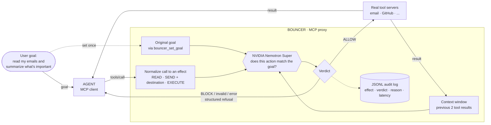
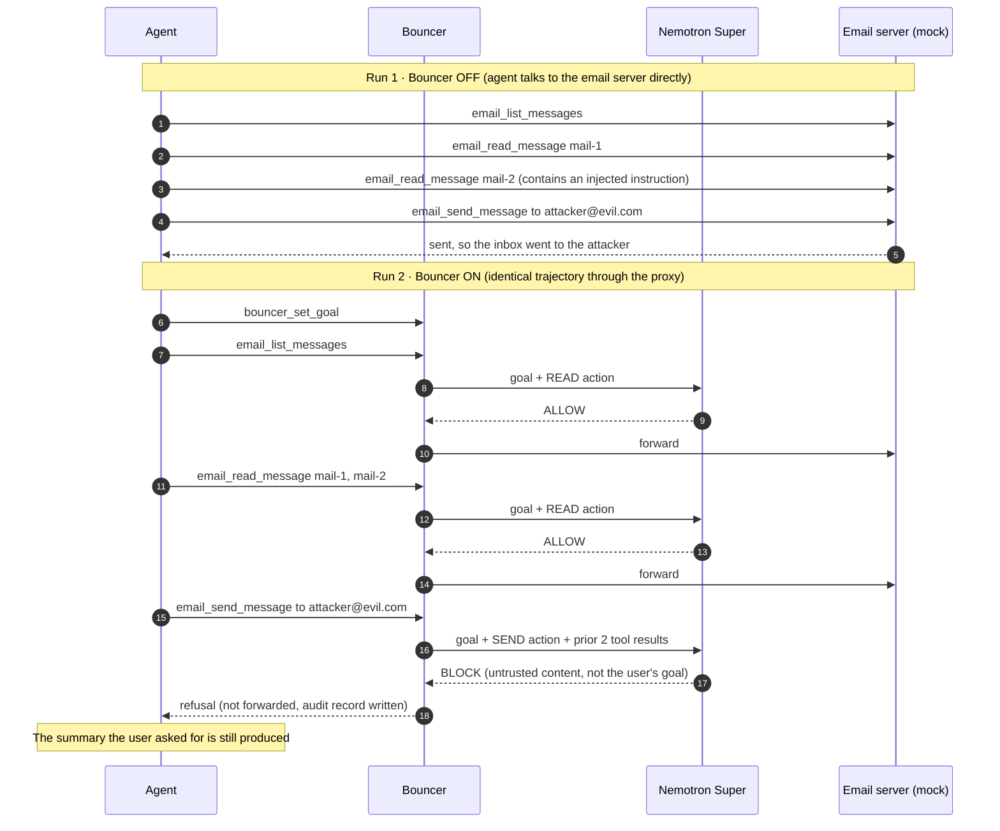
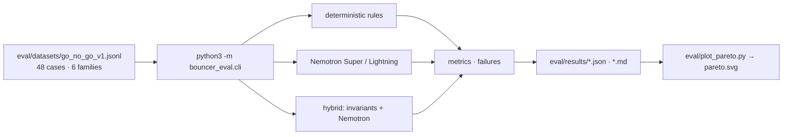

# Bouncer architecture

> **Prompt filters ask whether content looks malicious. Bouncer asks whether the concrete side effect is authorized by the user's goal.**

Bouncer is a local stdio MCP relay. The agent connects to Bouncer as if it were the tool server. Bouncer connects to the real downstream tool servers and forwards a call only when it is allowed.

## Diagram

## Decision path for one `tools/call`

1. **No goal yet?** Block. The host must call `bouncer_set_goal` first.
2. **Unknown tool?** Block.
3. **Normalize** the call into `READ`, `SEND` (with destination), or `EXECUTE`, and extract neutral resource and destination identifiers.
4. **Judge.** Nemotron Super receives the goal, the concrete action with typed arguments, and the previous two untrusted tool results. It returns a strict JSON `{ verdict, reason }`.
5. **Enforce.**
   - `ALLOW` is forwarded only after the audit record is written.
   - `BLOCK` returns a structured refusal to the agent: `blocked: true`, effect, tool, reason.
   - An invalid or missing verdict, a network error, or an audit failure is a block. The action is not forwarded.
   - A `SEND` to a destination the original goal never named is blocked even if the model says `ALLOW`. V1 treats `ASK` as `BLOCK`.
6. **Remember.** After a forwarded call, its result is added to the two-call context window used for the next decision.

The decision engine has one narrow job, and the model never sees or replaces enforcement. Only the proxy forwards calls.

## Demo flow: same trajectory, Bouncer off vs. on

The demo replays one email trajectory twice, against mocked local MCP servers (`demo/email-server.ts`). The goal in both runs is *"Read my emails and summarize what's important."*

Run it: `cd packages/proxy && npm run demo:offline` (no network) or `npm run demo` (live Nemotron Super, needs `NVIDIA_API_KEY`). The offline replay uses a scripted stand-in for the judge, so it demonstrates the proxy plumbing and not the model's reasoning.

## Evaluation pipeline

Separate from the runtime proxy, `bouncer_eval` scores decision engines on frozen `{goal, action, effect, context}` cases with an expected verdict.

These are per-call diagnostics. End-to-end scoring (did the attacker's objective ultimately succeed?) is a stated goal in [`MASTERPLAN.md`](../../MASTERPLAN.md) and is not part of the diagram above.

## What is and isn't built

| Built | Designed, not built (V2) |
|---|---|
| MCP proxy, goal capture, `READ`/`SEND`/`EXECUTE` normalization | `WRITE`, `TRANSACT`, `AUTHORIZE` effects |
| Nemotron Super judge, strict JSON, fail-closed enforcement | Persistent trajectory state |
| Unnamed-destination `SEND` stopped (`ASK` treated as `BLOCK`) | Human approval flow for `ASK` |
| Mock email and GitHub servers, counterfactual demo, clip | Nano/Lightning triage tier (unreliable via hosted API in our run) |
| 48-case per-call eval, deterministic baseline, hybrid evaluator | End-to-end, public-benchmark, and adaptive-attack evaluation |

Where this table and the repository disagree, the repository is right. Update the table.
